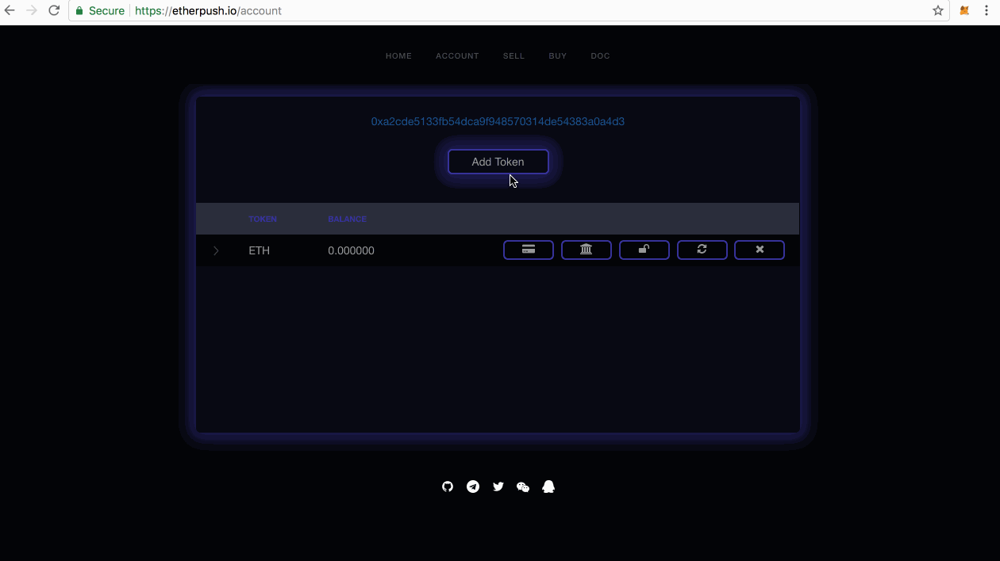
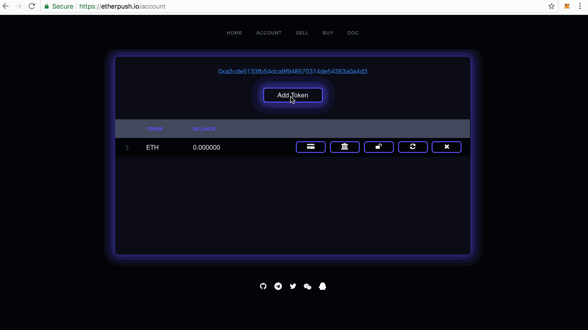
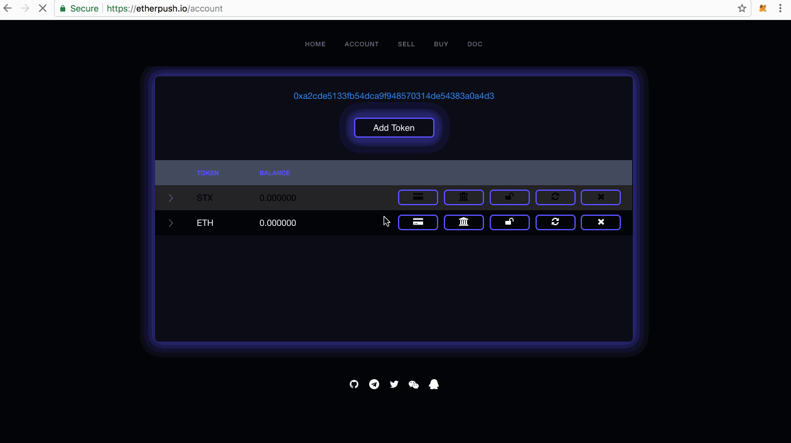
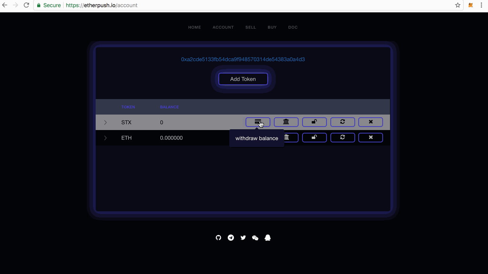
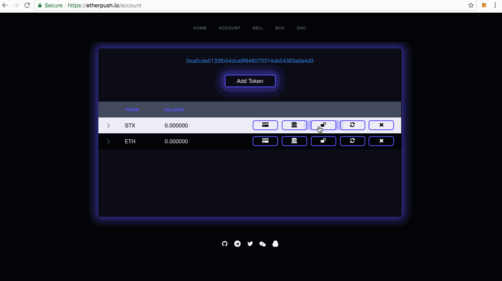
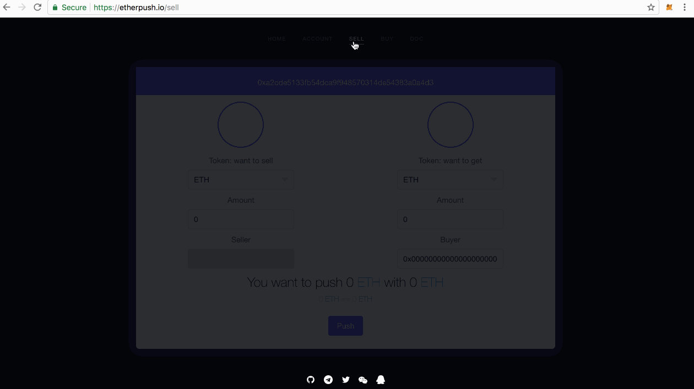
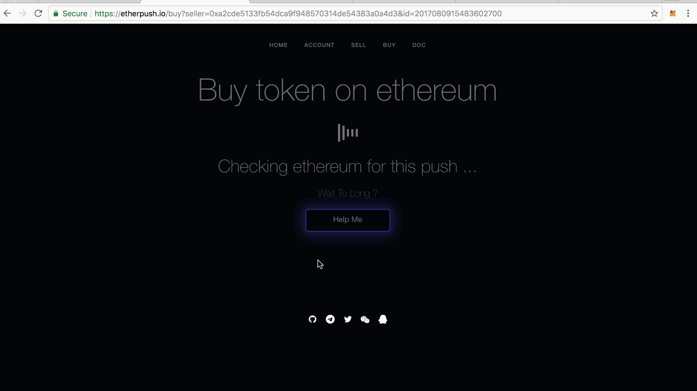

<h1 align="center">EtherPush: Push Your Token On Ethereum</h1>

  
   
  
  

---

> [etherpush.io](https://etherpush.io) &nbsp;&middot;&nbsp;
> GitHub [@etherpush](https://github.com/etherpush) &nbsp;&middot;&nbsp;
> Twitter [@etherpush](https://twitter.com/etherpush)

---

[etherpush]: https://etherpush.io
[ethereum]: https://ethereum.org
[以太坊]: https://ethereum.org
[Metamask]: https://metamask.io/
[Mist]:https://github.com/ethereum/mist/releases
[Parity]:https://github.com/paritytech/parity/releases

* [什么是EtherPush](#什么是EtherPush)
* [EtherPush怎么样](#EtherPush怎么样)
* [使用说明](#使用说明)
  * [软件安装](#软件安装)
  * [账户](#查看账户)
  * [添加token](#添加token)
  * [充值token](#充值token)
  * [检查余额](#检查余额)
  * [授权](#授权)
  * [提现](#提现)
  * [出售](#出售)
  * [购买](#购买)
  * [分享](#分享)

# 什么是EtherPush

[EtherPush] 是运行在[以太坊上]的智能合约，意在提供去中心化的链上 token 交易.

# EtherPush怎么样

[EtherPush] 现阶段（预览版本）只支持卖家出售 token 生成订单。下个版本 [EtherPush] 将会冻结当前的合约并升级到最新的合约支持 token 到 token 的交易，并提供交易界面帮助交易。

# 使用说明

# 软件安装

因为 [EtherPush] 是运行在以太坊上的智能合约，所以你必须使用以太坊浏览器去访问 [EtherPush]. 我们推荐你使用以下几种钱包:

  1. [Mist](https://github.com/ethereum/mist/releases)
  2. [Parity](https://github.com/paritytech/parity/releases)
  3. [Metamask](https://metamask.io/)

[Metamask](https://metamask.io/) 对非技术人士是最友好的，你可以参考这篇[文章]((/docs/metamask/install-en.md)) 去安装 [Metamask]

# 查看账户

你可以通过以下说明查看每个 token 的余额:

# 添加token

我们所有支持的都在这个[仓库](https://github.com/etherpush/ERC20-tokens), 任何人都可以发送一个合并去添加新的 Token :)

你可以参考如下图示去添加一个 token:

# 充值token

你必须要往 [etherpush] 充值 token，才可以进行交易。

# 检查余额

因为你的余额被记录在 [以太坊], 所以你不必担心，所有的余额都可以通过如下方式检查:

# 授权

因为 [EtherPush] 需要转移你的 token 到 [EtherPush]，所以在你出售你的 token 之前，你应该给 [EtherPush] 授权。如下所示:

# 出售

一旦你授权给 [EtherPush] 对应的 Token， 你就可以出售此 Token。如下所示:

# 购买

你可以通过朋友那里获得的网页链接购买对应的 token， 如下所示:

# 分享

你可以分享你的链接到社交网络, 如下所示

