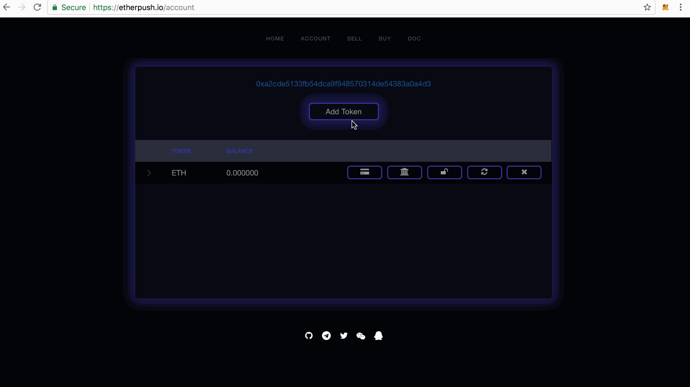
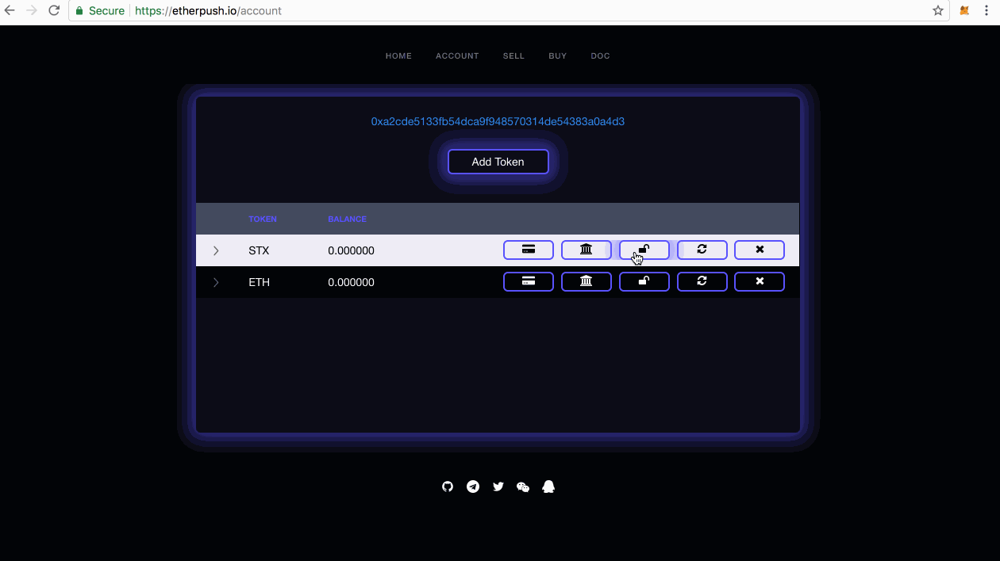
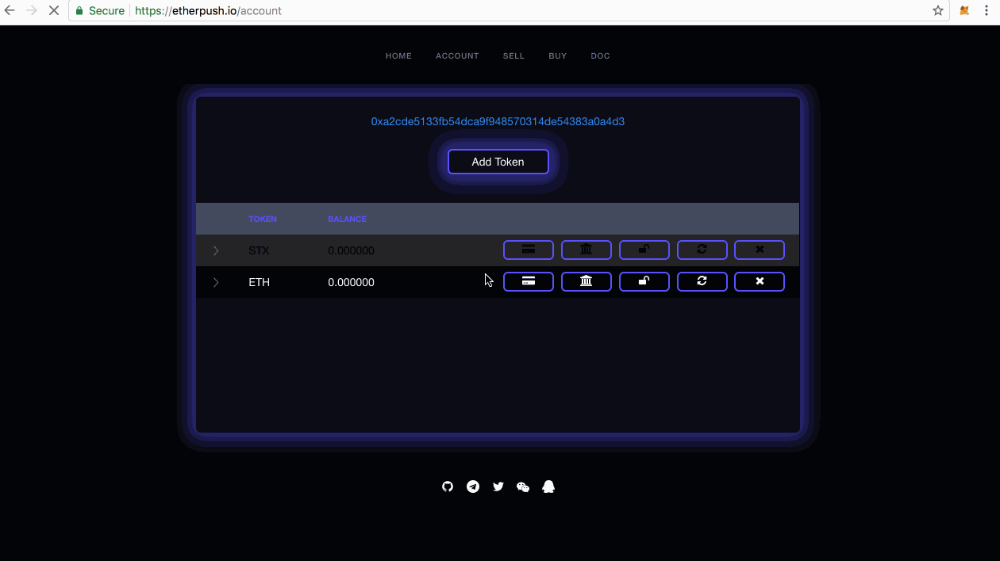
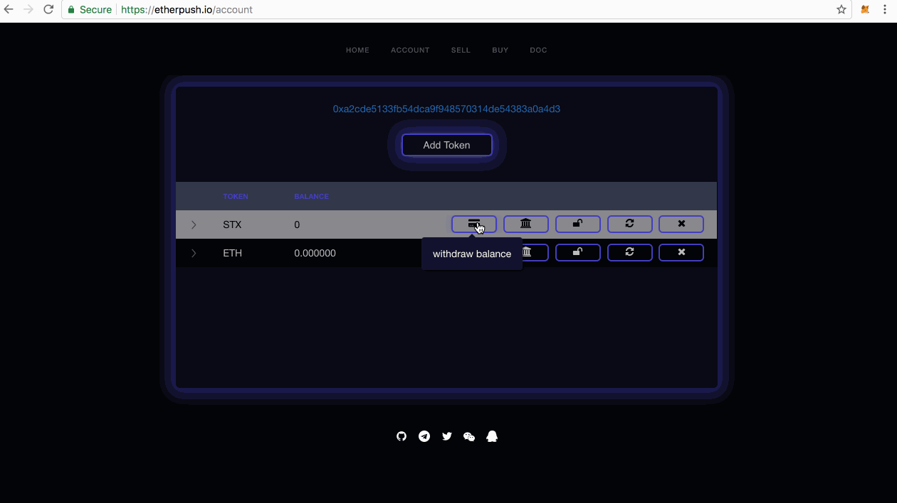
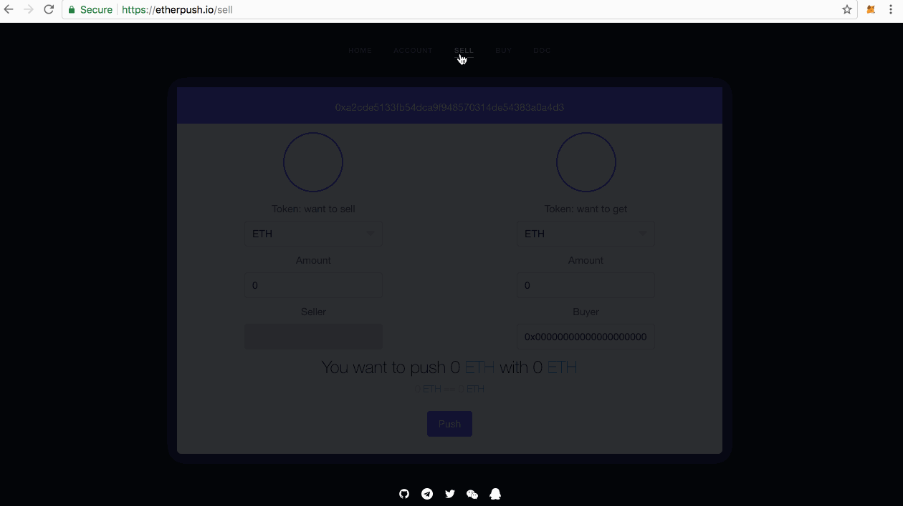

<h1 align="center">EtherPush: Push Your Token On Ethereum</h1>

  
   
  
  

---

> [etherpush.io](https://etherpush.io) &nbsp;&middot;&nbsp;
> GitHub [@etherpush](https://github.com/etherpush) &nbsp;&middot;&nbsp;
> Twitter [@etherpush](https://twitter.com/etherpush)

---

[etherpush]: https://etherpush.io
[ethereum]: https://ethereum.org
[Metamask]: https://metamask.io/
[Mist]:https://github.com/ethereum/mist/releases
[Parity]:https://github.com/paritytech/parity/releases

* [What](#what)
* [How](#how)
* [Usage](#usage)
  * [Prerequisite](#prerequisite)
  * [Account](#account)
  * [AddToken](#addtoken)
  * [Approve](#approve)
  * [Deposit](#Deposit)
  * [CheckBalance](#checkbalance)
  * [Sell](#sell)
  * [Buy](#buy)

# What
[etherpush] is a dapp (smart contract) based on the [ethereum] which aims to provide the token <=> token exchange on the decentralized [ethereum].

# How

Now the [etherpush] only support seller push token and share the order to friends for beta. And next milestone it will freeze current the contract and upgrade to new the contract to support token <=> token exchange.

# Usage

# Prerequisite

[etherpush] is running on the [ethereum]. So you should use ethereum browser to open [etherpush]. We are recommended to use the wallet as the following:
  1. [Mist](https://github.com/ethereum/mist/releases)
  2. [Parity](https://github.com/paritytech/parity/releases)
  3. [Metamask](https://metamask.io/)

The [Metamask](https://metamask.io/) is easy to non-technology users. You can check [this](/docs/metamask/install-en.md) to install [Metamask]

# Account

You can check your token balance on account page as the following:

# AddToken

Our Avaliable token is landed in [https://github.com/etherpush/ERC20-tokens](https://github.com/etherpush/ERC20-tokens), Any one can send a PR to it :)

If you want to add token, just do as the following:

# Approve

Because [etherpush] will transfer your token balance to [etherpush], So before you pushing your token, you should approve permission to [etherpush] as the following:

# Deposit

After approving the token, you can deposit token to etherpush] as the following:

# CheckBalance

Your balance is recorded in [ethereum], So you have to check the balance on [ethereum] as the following:

# Sell

Once you approve [etherpush] to transfer your token, You can sell token as the following:

# Buy

You can buy the token by the URL from your friends like  as the following:

